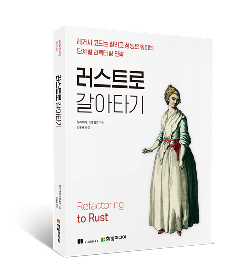

# '러스트로 갈아타기' 책의 소스 코드

[책 구매하기(원서)][buy_book]

[책 구매하기(번역서)][buy_book_kor]

이 리파지토리에는 새 책 _'러스트로 갈아타기'_ 의 모든 소스 코드 목록이 있습니다.
소스 코드 목록은 장 번호와 책의 코드 번호 순으로 정리되어 있습니다.
단일 목록에 표현하기 어려운 큰 예제는 별도의 디렉터리에 있습니다.

## 코드 실행하기

대부분의 예제는 러스트 또는 파이썬3으로 작성되었습니다.
최신 Rust 컴파일러는 https://rustup.rs/ 의 안내에 따라 설치할 수 있습니다.

간단한 러스트 예제는 소프트웨어를 설치하지 않고 웹 브라우저에서 실행할 수 있습니다.
https://play.rust-lang.org/ 를 방문하세요.

**중요**: 책의 일부 절에서는 러스트를 처음 접하는 개발자가 흔히 저지르는 컴파일 오류를 보여줍니다.
디렉터리 이름에 NO_COMPILE이 포함된 코드는 컴파일되지 않고 실패합니다.

[buy_book]: https://www.manning.com/books/refactoring-to-rust?utm_source=mara&utm_medium=affiliate&utm_campaign=book_mara_refactoring_1_6_21&a_aid=mara&a_bid=eedce54d
[buy_book_kor]: https://www.hanbit.co.kr
